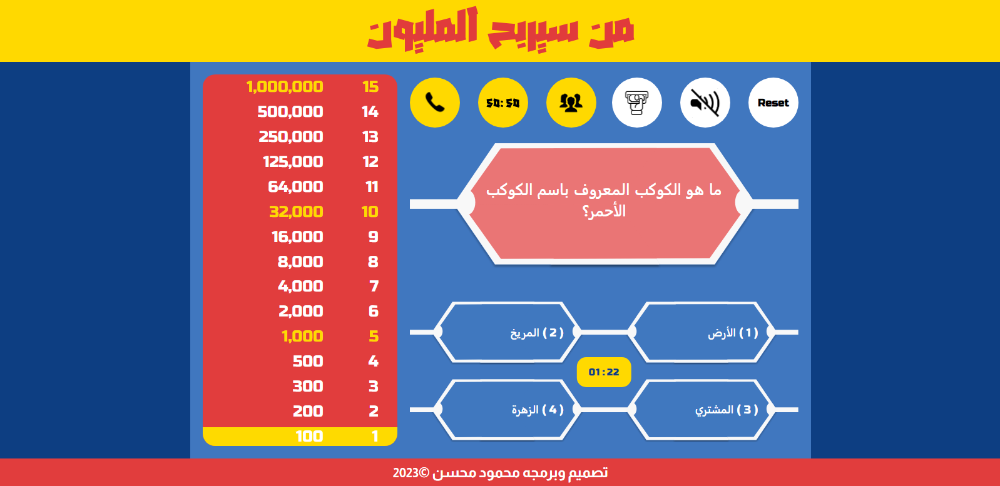

# Who will win the Million

An interactive web-based quiz game inspired by the popular TV show "Who Wants to Be a Millionaire."

</img>

Check out the live Demo [Who Will Win the Million](https://mahmoud-mohsen-dev.github.io/who-will-win-the-million/) and start playing now!

## How to Use

1. **Answer Questions:**

    - Read each question carefully and select the correct answer from the options provided.

2. **Progress and Lifelines:**

    - Track your progress as you answer questions and use available lifelines strategically.

3. **Winning the Million:**
    - Keep answering questions correctly to reach the one million mark and emerge as the winner!

## Game Features

### Lifelines

Each game has a set of lifelines to assist the player with the questions. In the standard format, each game has three lifelines, and each lifeline can be used only once per game. It's also possible to use more than one lifeline on a single question. The standard lifelines used in the original format of the game show include:

-   **50:50 (Fifty-Fifty):**

    -   The app eliminates two wrong answers from the current question, leaving behind the correct answer and one incorrect answer.

-   **Phone a Friend:**

    -   The timer starts as soon as The player clicks on the friend button, The player is given 30 seconds to press (the right key and the left key on the keyboard)[on desktop] or (touch the button) [on mobile or tablet devices] to fill the bar to the end
    -   if the player enabled the audio it will play the answer when reaching the target bar
    -   if the player mutes the audio it will display the correct answer on the screen

-   **Ask the Audience:**
    -   The app tallies the results and displays them as percentages to the player.

### Withdraw

-   A player can withdraw only when answering questions worth 1,000 or 32,000 points and will be directed to the win page.

### Questions

This game consists of 195 Questions every game has a unique set of questions

## Try it Live!

Check out the live app [Who Will Win the Million](https://mahmoud-mohsen-dev.github.io/who-will-win-the-million/) and start playing now!

## Getting Started

1. Clone this repository.

    ```bash
    git clone https://github.com/mahmoud-mohsen-dev/who-will-win-the-million.git
    ```

2. Navigate to the Project Directory:
    ```bash
    cd who-will-win-the-million
    ```
3. Install Dependencies:

    using npm

    ```bash
     npm install
    ```

4. Development Server

    ##### Start the Development Server:

    ```bash
    npm run dev
    ```

5. Open in your Browser:

    Open your web browser and go to http://localhost:3000 to see the app in action.

Ready to Play!
Now you have the "Who Will Win the Million" app up and running on your local machine. Start playing and enjoy the quiz!

## Contributing

If you'd like to contribute to the development of this quiz game, feel free to fork the repository, create a new branch for your feature or bug fix, and submit a pull request with a detailed description of your changes.
